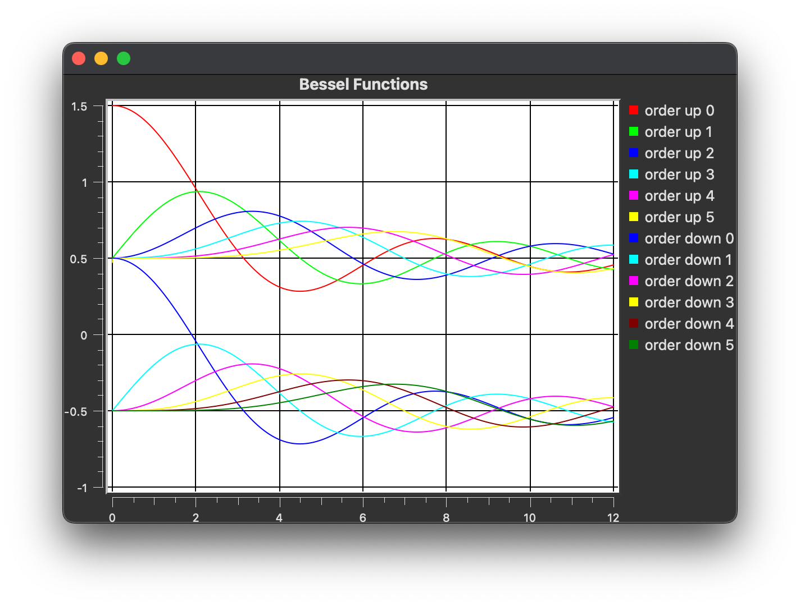
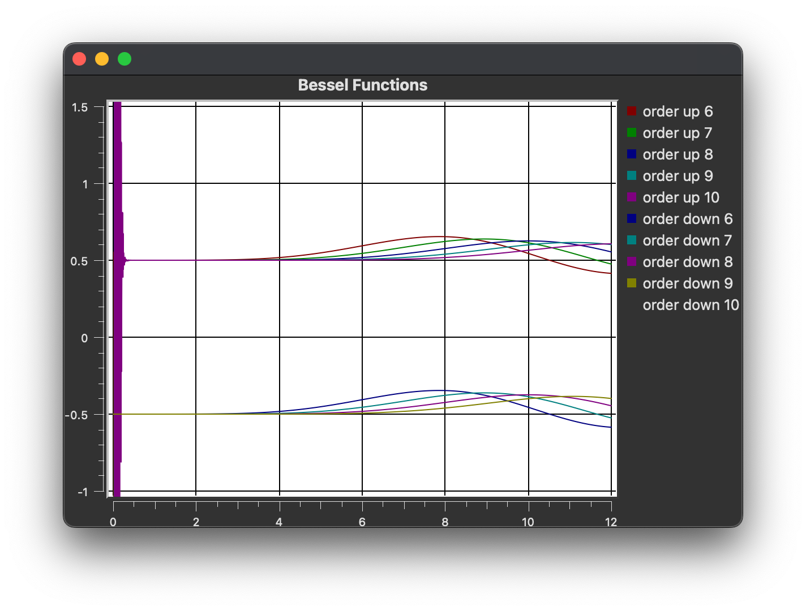

## Introduction
Since I had free time after the end of the semester, I decided to learn computational physics. This program is part of exercise 2.2 of the computational physics textbook by Landau (2015)[^1]. To do that, I decided to use C++ with Qt and Qwt as the graphics library. As a start, lets try plotting out the Bessel function that is very common in physics.

[^1]: Landau, R. H. (2015). Computational physics problem solving with python. John Wiley & Sons, Incorporated. 

## Bessel functions
Bessel functions are canonical solutions to the differential equation of the form 

$$x^2\frac{d^2y}{dx^2}+x\frac{dy}{dx}+(x^2-\alpha^2)y=0$$
 

We can get solutions $j_{\alpha}$ for integer $\alpha$ using numerical recursion relations with  

$$j_{\alpha+1} = \frac{2\alpha+1}{x}j_{\alpha}-j_{\alpha-1}$$
 

being the relation by recursing up from $j_0=\frac{sin(x)}{x}$ and 

$$j_{\alpha-1} = \frac{2\alpha+1}{x}j_{\alpha}-j_{\alpha+1}$$
 

being the relation by recursing down from an arbitrary high $\alpha$ to the required order. Furthermore, the result for the down recursion must be normalized by multiplying by $\frac{\text{sin}(x)}{xj_0}$. 

## Disadvantages of up recursion
Although the up recursion seems to be the better choice as we don't need to start from high $\alpha$ and normalize the result, there are disadvantages too. Due to the nature of the relation, recursing up permits the buildup of large precision error for small values. We can see below that although uo recursion works fine for lower orders of $\alpha$ it fails for higher orders.

## Conclusion
Although simple, this was a fun exercise. I initially wanted to use QtCharts for the plotting but found that Qwt had alot more resources and useful graphics. Unfortunately I still cannot figure out how to use CMake for Qwt so I will be using QMake.

